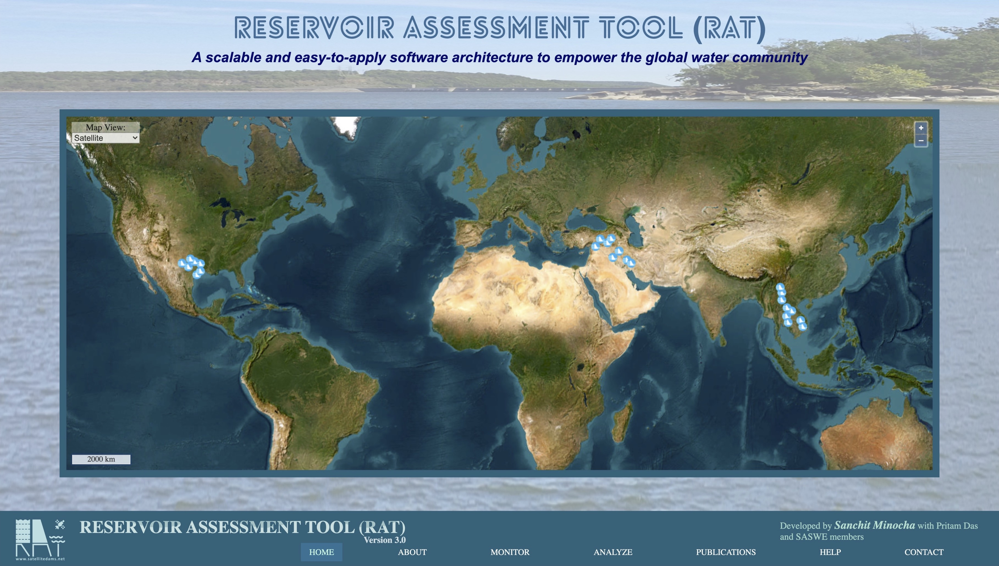
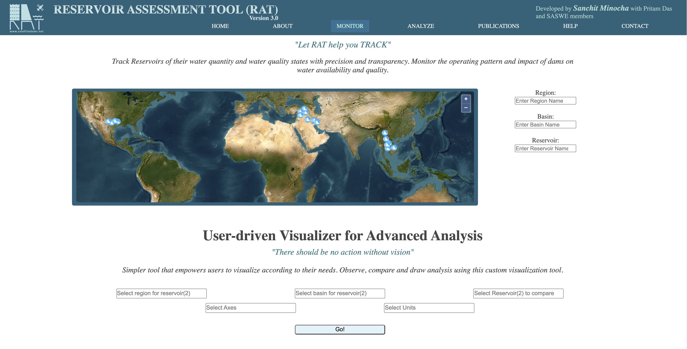
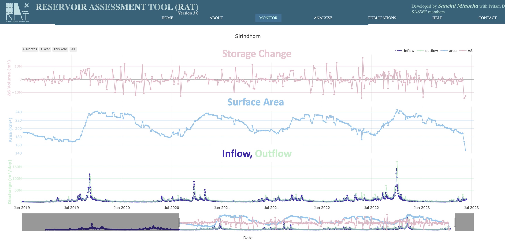
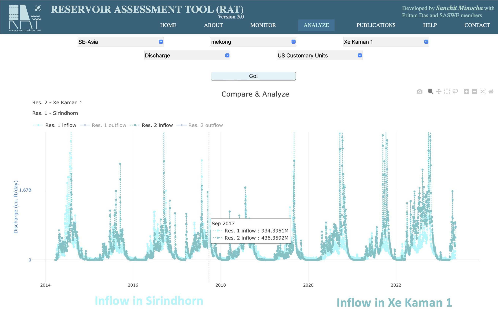

# Web Application

An interactive web application for RAT {{rat_version.major}}.{{rat_version.minor}} has been developed and can now be accessed at [www.satellitedams.net](http://www.satellitedams.net). This platform serves as an informational hub for RAT and provides users with an interactive map to visualize and analyse data from numerous dams worldwide. In addition, this global web app offers a comprehensive 'HELP' section where users can access three types of educational and training resources. These are: 1) accessing the source codes from the RAT {{rat_version.major}}.{{rat_version.minor}} github page; 2) detailed software documentation hosted on ratdocs.io and 3) comprehensive tutorial detailing how to execute each of the 14 key steps for RAT {{rat_version.major}}.{{rat_version.minor}} installation. Those interested in deepening their understanding of the tool can explore the 'PUBLICATIONS' section to access relevant literature and enhance their knowledge. 

The web application has been carefully developed to cater to a wide range of users, including stakeholders, government officials, and the general public. The key idea was to make it easy for users to access and visualize the dynamic outputs on reservoir state that are routinely generated by University of Washington developers to develop a first-cut understanding. Currently, the tool offers data for reservoirs located in the Texas-Gulf, Mesopotamia, and Southeast Asian river basins, with plans to include information on 1600 major dams worldwide that were originally monitored in RAT 1.0 in the near future (below figure). Once the tool becomes operational for most of the world’s major reservoirs, users will have access to data (with a 3-day latency) on the dynamic state reservoirs (hindcast and nowcast). We firmly believe that every individual user or entity should have equal access to such information of our managed water resources. By making this data publicly available on the global web app, the developers have contributed their part to mitigating the lack of access to water information in transboundary and ungauged river basins.

We have implemented an advanced visualizer feature (below figure) to expand the capabilities of the web application and meet the diverse requirements of different entities and stakeholders. With this feature, users can extract meaningful information without the hassle of downloading the data, allowing for a more streamlined and efficient analysis process.

The advanced visualizer component allows users to conduct in-depth analyses using the reservoir data by plotting multiple axes on a single interactive graph, such as discharge, surface area, and storage change (below figure). 

This functionality extends to any two reservoirs globally, providing the flexibility to perform comparative analyses (below figure). For instance, users can compare the outflow of an upstream dam with the inflow of a downstream dam, shedding light on the dynamics between the two. Another scenario may involve plotting the surface area of a reservoir alongside its inflow, allowing users to gain a comprehensive understanding of the relationship between these reservoir state variables.
