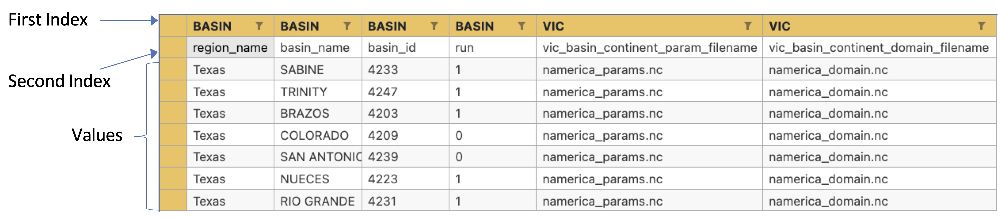

# RAT execution for Multiple Basins

RAT {{rat_version.major}}.{{rat_version.minor}} offers user the flexibility to run RAT for multiple basins using a single configuration file. Please note that this feature will not save time in execution of RAT for multiple basins or run it in parallel mode. It will simply execute RAT for each basin in a sequential mode. The only advantage of using this feature is that the user will not have to prepare and work with multiple configuration files which can be difficult to handle. 

To implement this feature RAT uses `basins_metadata` which is a csv file that is multi-indexed and have same indexing as ['rat_config.yml'](../rat_config). Below is a snapshot of how `basins_metadata` should look like. 

It should definitely have the index `basin_name` for section `BASIN` as it needs to be different for all basins and same is true for `basin_id`. Rest all those parameters which do not vary between basins can be provided in the configuration file and those which will vary must be provided in the `basins_metadata` csv file. 

!!! tip_note "Tip"
    1. To make use of `basins_metadata`, `multiple_basin_run` in `GLOBAL` section should be `true`.
    2. The values of `basin_name` from  `basins_metadata` should be provided in the list `basins_to_process` for all the river basins for which you want to run RAT for.
    3. A sample copy of `basins_metadata` is provided in 'params' folder inside `project_dir` with the name of 'basins_metadata_sample.csv'.