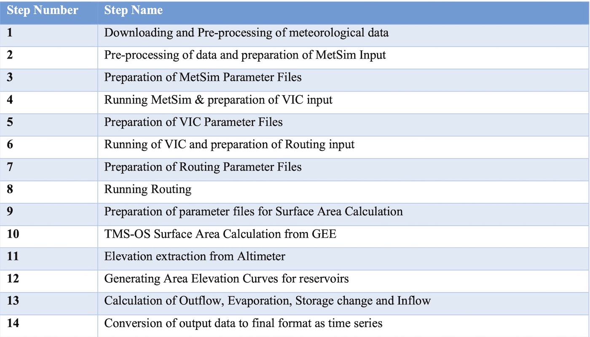
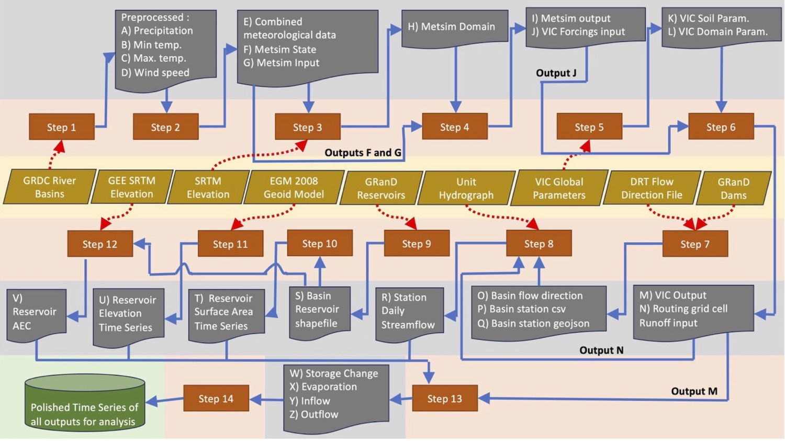

# Computational Model

The RAT {{rat_version.major}}.{{rat_version.minor}} computational framework comprises 14 key steps that need to be executed successfully to complete a RAT installation run. While these steps are independent in their execution, some of them may depend on others for input. For example, outflow calculation requires the prior execution of inflow estimation through VIC and its streamflow routing. Hence, users must ensure that any omitted step has already run or that its output does not serve as input for another step. This independent execution of steps is advantageous as it eliminates the need to rerun previously executed steps during debugging or software enhancement exercises. Additionally, users have the flexibility to choose specific steps to execute, allowing them to run just individual steps, such as the surface area time series calculation instead of a complete RAT run. Given below is a list of steps shown in a table. 

The workflow diagram shown below summarizes the comprehensive process employed by RAT {{rat_version.major}}.{{rat_version.minor}}, executing the 14 key steps to generate essential reservoir data, including inflow, outflow, storage change, and evaporation.

!!! tip_note "Tip"
    RAT {{rat_version.major}}.{{rat_version.minor}} has two hidden and mandatory steps named as '-1' and '0'. Step '-1' reads configuration settings to run RAT while step '0' creates the required directory structure for RAT.

!!! note
    1. From here-on, in this section, bold words represents either file names or file paths or directory paths. If just a file name is mentioned, its location will be likely in `data_dir`>`region_name`>basins>`basin_name`> and the step you are dealing with. For example if step-4 is running metsim and you are looking at its input, the exact path will be `data_dir`>`region_name`>basins>`basin_name`>metsim>metsim_inputs>metsim_input.nc.

    2. If the path or name of a file or folder contains a word enclosed in angular bracket then that means the particular word is a variable and is actually substituted by the value of the variable when the actual file/folder is created.

    3. In case of <b>&lt;dam.csv&gt;</b> the 'dam' is substituted by <b>&lt;id&gt;\_&lt;name&gt;</b> if `station_global_data` is `True`. The values of 'id' and 'name' are taken by `stations_vector_file` and all spaces in 'name' are replaced by '_'. 

    4. In case of <b>&lt;dam.csv&gt;</b> the 'dam' is substituted by <b>&lt;name&gt;</b> if `station_global_data` is `False`. The values of 'name' are taken by `station_latlon_path` (or `station_file`in Routing Parameters in configursation file) and all spaces in 'name' are replaced by '_'. 

## Step-1 
Downloading and Pre-processing of meteorological data  
 Task:  Downloading of real-time raw meteorlogical data from different servers (precipitation from IMERG or GEFS, and temperature and wind data from NOAA or GFS). The downloaded data is then pre-processed (scaled, aligned and clipped to basin - shown in the figure below) for further use.   
 Input Files:  No input file is required.   
 Output Files:  1. Global data for daily precipitation in geotif format. (<b>`data_dir`>raw>precipitation</b>)  
2. Global data for minimum and maximum temperature, and wind speed at daily frequency with a NetCDF file for each year and each variable. (<b>`data_dir`>raw>tmax/tmin/uwnd/vwnd</b>) 
3. Pre-processed data in the form of one file (ascii format) for each day and for each variable (precipitation, min-temperature, max temperature, and wind speed in u and v directions) (<b>`data_dir`>`region_name`>basins>`basin_name`>pre_processing>processed> precipitation/tmax/tmin/uwnd/vwnd</b>).

## Step-2 
Pre-processing of data and preparation of MetSim Input  
 Task:  All pre-processed data (for all days and variables) is aggregated into a single NetCDF file. It is then used to create two of metsim input files - (1) metsim_input.nc (having data for days for which you want to run MetSim) and (2) state.nc (having data for 90 days prior to the duration for which you want to run MetSim).   
 Input Files:  1. Pre-processed files (created in step 1) are required.  
2. River basin polygon geometry from river basin shapefile is required (has to be provided by user).  
 Output Files:  1. All preprocessed data combined in a single NetCDf file (<b>combined.nc</b>).  
2. Two of MetSim Input files (<b>metsim_input.nc</b> and <b>state.nc</b>).
3. A grid file for the river basin is created with spatial resolution of 0.0625° (<b>&lt;basin_name&gt;_grid_mask.tif</b>).

## Step-3 
Preparation of MetSim Parameter Files  
 Task:  MetSim requires a domain NetCDF file for the river basin which is automatically prepared (in case, not provided by user) in this step using a digital elevation   
 Input Files:  1. A digital elevation model is required in geotif format where elevation is in meters and crs is WGS84.  
2. River basin polygon geometry from river basin shapefile is required (has to be provided by user).  
 Output Files:  1. A domain file required as a parameter file for executing MetSim (<b>domain.nc</b>). 

## Step-4 
Running MetSim & preparation of VIC input  
 Task:  Updates the 'yaml' configuration parameter file (<b>params.yaml</b>) required to execute MetSim and then execute MetSim using number of cores specified by the user and saves its outputs. Then the output is converted into a format suitable for VIC input.  
 Input Files:  1. MetSim configuration parameter file (<b>params.yaml</b>).  
2. MetSim domain parameter file (<b>domain.nc</b> - created in step 3 if not provided by user).  
3. Metsim input data (<b>metsim_input.nc</b> and <b>state.nc</b> - created in step 2.)  
 Output Files:  1. Updated MetSim configuration paramater file (<b>params.yaml</b>).  
2. Simulated weather data as output (<b>6h_VIC_&lt;start&gt;-&lt;end&gt;.nc</b>).  
3. Simulated weather data as input for VIC (<b>forcing_&lt;yeart&gt;.nc</b>)

## Step-5 
Preparation of VIC Parameter File  
 Task:  Execution of VIC requires soil and domain parameter files. In case a user has not provided VIC parameter files for the basin and instead have provided parameter files of extent more than the basin, then RAT {{rat_version.major}}.{{rat_version.minor}} automatically creates the soil and domain paramter files for the basin.  
 Input Files:  1. Global (relative to basin) VIC domain parameter file (example - <b>africa_domain.nc</b>, has to be provided by the user).  
2. Global (relative to basin) VIC soil parameter file (example - <b>africa_params.nc</b>, has to be provided by the user).  
3. River basin polygon geometry from river basin shapefile is required (has to be provided by user).  
 Output Files:  1. River basin's VIC domain parameter file ( <b>vic_domain.nc</b>).  
2. River basin's VIC soil parameter file (<b>vic_soil_param.nc</b>).

## Step-6 
Running of VIC and preparation of Routing input
  
 Task:  Updates the 'txt' parameter file (<b>vic_params.txt</b>) required to execute VIC and then executes VIC using number of cores specified by the user and saves its outputs. Then the output is converted into a format suitable for Routing input.  
 Input Files:  1.  VIC configuration parameter file (<b>vic_params.txt</b>).  
2. VIC domain parameter file (<b>vic_domain.nc</b> - created in step 5 if not provided by user).  
3. VIC soil parameter file (<b>vic_soil_param.nc</b> - created in step 5 if not provided by user).  
4. VIC input data (<b>forcings_&lt;yeart&gt;.nc</b> - created in step 4 for each year.)  
 Output Files:  1. River basin's VIC initial state  file for the end date of the period for which RAT has been executed( <b>state_&lt;end&gt;.nc</b>).  
2. VIC output containing the gridded surface runoff (<b>nc_fluxes_&lt;start&gt;.nc</b>).  
3. VIC gridded surface runoff in the input format for Routing (<b>fluxes_&lt;lat&gt;\_&lt;lon&gt;.nc</b> for every grid cell).  

## Step-7
Preparation of Routing Parameter File  
 Task:  Execution of Routing requires river basin's grid flow direction file. In case a user has provided a vector file for stations(dams), where geometry is represented by their point location, rather than just a station-csv file, then RAT {{rat_version.major}}.{{rat_version.minor}} automatically creates the station-csv file which will be further used to creation station_xy file (in step 8) required to execute Routing.  
 Input Files:  1. Global (relative to basin) Grid flow direction file in Geotif format at 0.0625° spatial resolution (has to be provided by the user).  
2. Global (relative to basin) station vector file where geometry is represented by point locations of dams/stations in either geojson or shapefile format (only required if `station_global_data` is `True`). 
3. River basin polygon geometry from river basin shapefile is required (has to be provided by user).  
 Output Files:  1. River basin's Grid flow direction file ( <b>fl.asc</b>).  
2. River basin's station-csv file (<b>basin_station_latlon.csv</b>).

## Step-8 
Running of VIC and preparation of Routing input
  
 Task:  Updates the 'txt' parameter file (<b>route_param.txt</b>) required to execute Routing and then executes Routing for each station/dam in parallel computational mode and saves its outputs. Then the output will be converted into inflow values in Step-13.  
 Input Files:  1.  Routing configuration parameter file (<b>route_param.txt</b>).  
2. Routing grid flow direction file (<b>fl.asc</b> - created in step 7 if provided by user is global (relative to basin) in extent).  
3. Routing station-csv file (<b>basin_station_latlon.csv</b> - created in step 7 if `station_global_data` is `True`).  
4. Routing unit hydrograph parameter file (<b>uh.txt</b> - Standard unit hydrograph file is used for every grid cell of river basin.) 
5. Routing input data (<b>fluxes_&lt;lat&gt;\_&lt;lon&gt;.nc</b> for every grid cell - created in step 6).   
 Output Files:  1. River basin's Routing initial state file for the end date of the period for which RAT has been executed ( <b>rout_init_state_file_&lt;end&gt;.nc</b>).  
2. Routing output containing the daily streamflow (<b>&lt;station&gt;.day</b>).  

## Step-9
Preparation of parameter files for Surface Area Calculation  
 Task:  To calculate surface area time serirs of each reservoir, a vector file of reservoirs is required where the geometry is represented by the reservoir polygons. It should also contain columns: 'dam_name_column','id' and 'area'.  In case, you just want to use step-9 and 10, values of 'dam_name_column' and 'id' can be anything but otherwise it should match with the 'name_column' and 'id_column' of the station vector file used in step-7. In this step, a new shapefile (vector file) is created for the river basin from the user provided vector file  and contains only those reservoirs which lie inside the river basin.    
 Input Files:  1. Global (relative to basin) reservoir vector file (shapefile/geojson) where geometry is represented by reservoir polygons and should contain columns: 'dam_name_column','id' and 'area' (has to be provided by the user). The values of 'area' needs to be in Sq. Km.  
2.River basin polygon geometry from river basin shapefile is required (has to be provided by user).  
 Output Files:  1. River basin's reservoir vector file ( <b>basin_reservoirs.shp</b>).  

!!! note
    In case step-9 is not executed before step-10 (<b>basin_reservoirs.shp</b> has not been created) and `station_global_data` is `False`, then step-10 (and step-12) runs for all reservoirs in the reservoir vector file provided by the user, assuming that all the reservoirs lie within the river basin.

## Step-10
TMS-OS Surface Area Calculation from GEE  
 Task:  Calculate and extract surface area time series for each reservoir using Google Earth Engine (GEE). To extract data from GEE, data is downloaded in chunks (like for 5 dates at a time for each optical sensor based satellite and for each reservoir) and in between the downloading of these chunk datas, the system sleeps for 5-15 seconds.Therefore this step can take time for a longer duration but should be faster while operationalizing or for small durations.  
 Input Files:  1. River basin's reservoir vector file ( <b>basin_reservoirs.shp</b> - created by step-9; OR provided by user - if step 9 is not executed and `station_global_data` is `False`).   
 Output Files:  1. Small chunk files for each satellite (optical sensors) and each reservoir (<b>l8/s9/s2>_scratch</b>), which are used to form a complete file (<b>l8/s9/s2>&lt;dam&gt;.csv</b>). In case of SAR only the complete file is generated (<b>l8/s9/s2>&lt;dam&gt;.csv</b>).  
2. Finally a single surface area time series file is created for each reservoir using files from all the satellite missions if possible by using TMS-OS algorithm (<b>&lt;dam&gt;.csv</b>).  

## Step-11
Elevation extraction from Altimeter  
 Task:  Extracts elevation for a reservoir using Jason-3 altimeter for those reservoirs lying on the path of Jason-3. To extract data from GEE, data is downloaded in chunks (like for 5 dates at a time for each optical sensor based satellite and for each reservoir) and in between the downloading of these chunk datas, the system sleeps for 5-15 seconds.Therefore this step can take time for a longer duration but should be faster while operationalizing or for small durations.  
 Input Files:  1. Altimeter tracks in geojson format ( provided by the user)  
2. A matlab file for geoid grid (provided by the user).  
3. A csv file containing the names of reservoirs for which altimeter elevation extraction should be done (provided by user; Optional and by default if step-11 is executed it will extract elevation for all reservoirs on the altimetry path).   
 Output Files:  1. Raw downloaded altimetry data for each cycle for each reservoir (<b>`data_dir`>`region_name`>basins>`basin_name`>altimetry>raw>&lt;dam&gt;</b>).  
2. Extracted elevation data for each reservoir from raw altimetry data (<b>`data_dir`>`region_name`>basins>`basin_name`>altimetry>extracted>&lt;dam&gt;</b>). 
3. Final single elevation time series csv file for each reservoir (&lt;dam&gt;.csv).  

## Step-12
Generating Area Elevation Curves for reservoirs  
 Task:  Generates Area Elevation curve (AEC) using SRTM-30 digital elevation model in GEE for all those reservoirs for which AEC has not been provided by the user.  
 Input Files:  1. River basin's reservoir vector file ( <b>basin_reservoirs.shp</b> - created by step-9; OR provided by user - if step 9 is not executed and `station_global_data` is `False`).  
 Output Files:  1. Area elevation curve for each reservoir (<b>`aec_dir`>&lt;dam&gt;.csv</b> OR <b>`data_dir`>`region_name`>basins>`basin_name`>post_processing> post_processing_gee_aec >&lt;dam&gt;.csv</b> - if user has not provided `aec_dir`).  

## Step-13
Calculation of Outflow, Evaporation, Storage change and Inflow  
 Task:  Converts Routing streamflow values to inflow in \(m^3/s\). Calculates storage change time series for each reservoir using trapezoidal rule (in \(m^3\)). Then evaporation from reservoir is calculated using Penman Equation ( in mm). After that finally outflow is estimated using mass-balance approach in \(m^3/s\).  
 Input Files:  1. For generating inflow, Routing output containing the daily streamflow is required (<b>&lt;station&gt;.day</b> - created in step-8). 
2. For calculating storage change,reservoir's area elevation curve (&lt;dam&gt;.csv - created in step-12) and surface area time series (&lt;dam&gt;.csv - created in step-10) are required. 
3. For calculating evaporation, river basin's vic output (<b>nc_fluxes_&lt;start&gt;.nc</b> - created in step-6) for getting temperature, wind speed, air pressure and other meteorological data, and reservoir's surface area time series (&lt;dam&gt;.csv - created in step-10) are required. 
4. For calculating outflow, reservoir's inflow (&lt;dam&gt;.csv - created in step-13), storage change (&lt;dam&gt;.csv - created in step-13) and evaporation (&lt;dam&gt;.csv - created in step-13) are required. 
5. For copying AEC files to the same directory as other outputs, each reservoir's area elevation curve (&lt;dam&gt;.csv - created in step-12) is required.  
 Output Files:  1. Inflow for each reservoir (<b>`data_dir`>`region_name`>basins> `basin_name`>rat_outputs> inflow>&lt;dam&gt;.csv</b>).  
2. Storage change for each reservoir (<b>`data_dir`>`region_name`>basins> `basin_name`>rat_outputs> dels>&lt;dam&gt;.csv</b>).  
3. Evaporation for each reservoir (<b>`data_dir`>`region_name`>basins> `basin_name`>rat_outputs> Evaporation>&lt;dam&gt;.csv</b>).  
4. Outflow for each reservoir (<b>`data_dir`>`region_name`>basins> `basin_name`>rat_outputs> rat_outflow>&lt;dam&gt;.csv</b>).  
5. AEC for each reservoir (<b>`data_dir`>`region_name`>basins> `basin_name`>rat_outputs> aec>&lt;dam&gt;.csv</b>).  

## Step-14
Conversion of output data to final format as time series  
 Task:  Create final outputs in a time-series format (with proper units) to be used by the user directly for analysis. It then also cleans up memory by removing intermediate outputs as instructed by the user in [`CLEAN_UP` section](../../Configuration/rat_config/#clean-up).  
 Input Files:  1. All inflow, evaporation, storage change, aec and outflow outputs that were created in step-13. 
2. Each reservoir's surface area time series (&lt;dam&gt;.csv - created in step-10) are required.  
 Output Files:  1. Inflow for each reservoir (<b>`data_dir`>`region_name`>basins> `basin_name`>final_outputs> inflow>&lt;dam&gt;.csv</b>).  
2. Storage change for each reservoir (<b>`data_dir`>`region_name`>basins> `basin_name`>final_outputs> dels>&lt;dam&gt;.csv</b>).  
3. Evapofialion for each reservoir (<b>`data_dir`>`region_name`>basins> `basin_name`>final_outputs> evaporation>&lt;dam&gt;.csv</b>).  
4. Outflow for each reservoir (<b>`data_dir`>`region_name`>basins> `basin_name`>final_outputs> outflow>&lt;dam&gt;.csv</b>).  
5. AEC for each reservoir (<b>`data_dir`>`region_name`>basins> `basin_name`>final_outputs> aec>&lt;dam&gt;.csv</b>).  
6. Surface area for each reservoir (<b>`data_dir`>`region_name`>basins> `basin_name`>final_outputs> sarea_tmsos>&lt;dam&gt;.csv</b>).  