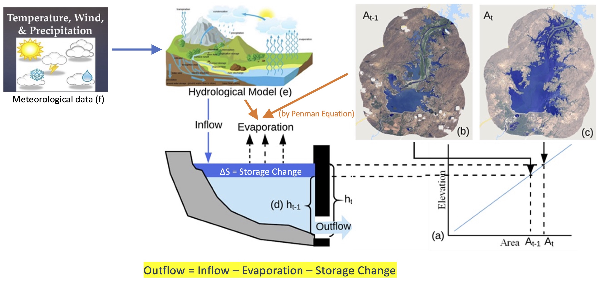
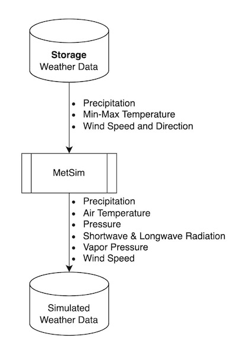
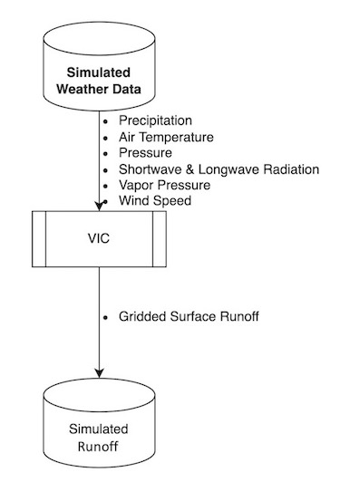
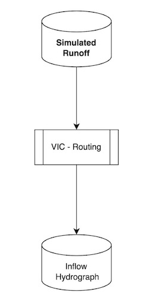
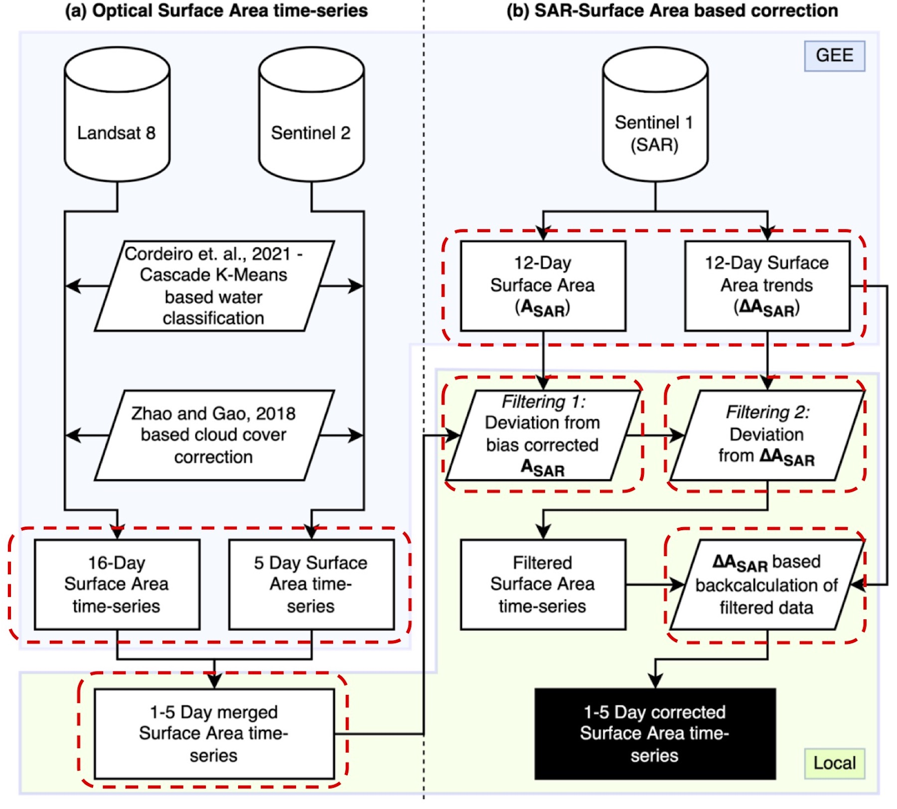
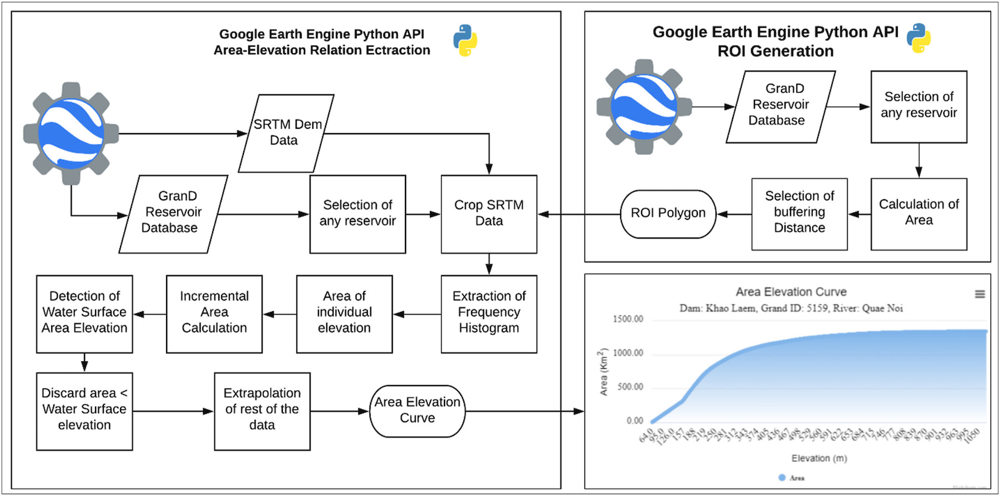

# Conceptual Model

RAT is a framework that employs satellite-based remote-sensing data and hydrological modeling to estimate the outflow of a reservoir via a mass balance equation. To estimate the inflow, RAT uses meteorological data and hydrological modeling. In RAT {{rat_version.major}}.{{rat_version.minor}}, the hydrological model used is the latest version of Variable Infiltration Capacity (VIC) model , also known as [VIC-5](https://vic.readthedocs.io/en/master/Overview/ModelOverview/). To compute storage change in a reservoir, two inputs are required: the area elevation curve (AEC) and the change in the surface area or elevation of the reservoir. The AEC is also known as Area-elevation volume (AEV) or hypsometric curves. The AEC curve summarizes quantitatively the bathymetry of the reservoir and helps compute the inundated area of the reservoir for a given storage level or vice versa. Consequently, with two successive satellite observations of water elevation or surface area, the storage change can be derived. 

In RAT {{rat_version.major}}.{{rat_version.minor}}, either the user can provide the AEC for a reservoir or otherwise, it will be automatically created using an available digital elevation model (DEM). The change in the surface area of the reservoir is estimated by observing the alteration in the number of water-classified pixels of the satellite imagery within the reservoir's region of interest. Alternatively, if the reservoir’s water surface elevation information is available, such as from nadir-looking radar altimeters, surface area can be estimated from the AEC. The Penman Equation (Penman, 1948) is used in RAT {{rat_version.major}}.{{rat_version.minor}} to calculate evaporation from a reservoir, leading to the estimation of reservoir outflow using the mass balance equation. The below figure summarizes the model overview of RAT {{rat_version.major}}.{{rat_version.minor}}.

## Inflow

The reservoir inflow is simulated using a hydrological model with streamflow routing capability. The entire workflow is shown in the flowchart below. The hydrological model used is Variable Infiltration Capacity (VIC) model for simulating the gridded surface runoff in the upstream catchment area of the reservoir. In [VIC 5](https://vic.readthedocs.io/en/master/), the meteorological simulation and forcing disaggregation are decoupled from the hydrological modeling, and are packaged as a separate model – [MetSim model](https://metsim.readthedocs.io/en/latest/). 

MetSim is used to perform the meteorological simulation at a 6-h timestep using (i) the daily minimum and maximum temperatures, (ii) daily precipitation, and (iii) wind speed, as inputs. To get these inputs, meteorological data is downloaded which includes precipitation, minimum and maximum temperature, and wind speed. The [IMERG Late product](https://gpm.nasa.gov/taxonomy/term/1415) is used to retrieve daily precipitation, while temperature and wind speed data are sourced from [NOAA NCEP/Climate Prediction Center](https://journals.ametsoc.org/view/journals/bams/77/3/1520-0477_1996_077_0437_tnyrp_2_0_co_2.xml). These meteorological forcings are then disaggregated to – (i) average air temperature, (ii) total precipitation, (iii) pressure, (iv) incoming shortwave radiation, (v) incoming longwave radiation, (vi) vapor pressure, and (vii) wind speed, which are the outputs from MetSim model. 

Using the disaggregated forcings obtained from MetSim, VIC 5 is executed at 0.0625° grid resolution to generate gridded surface runoff. It requires soil and land surface parameters which can be be provided by the user in [VIC section](../Configuration/rat_config/#VIC) in the configuration file and RAT {{rat_version.major}}.{{rat_version.minor}} uses the one prepared by [Jacob et al.(2021)](https://doi.org/10.1038/s41597-021-00999-4), by default.

The [VIC Routing model](https://vic.readthedocs.io/en/vic.4.2.d/Documentation/Routing/RunRouting/) is used to perform streamflow routing for the basinusing the gridded surface runoff. It requires grid flow direction file, from the user, at same resolution as the surface runoff (0.0625° spatial resolution) and RAT {{rat_version.major}}.{{rat_version.minor}} uses the Dominant River Tracing (DRT) based flow directions prepared by [Wu et al.(2011)](https://www.umt.edu/numerical-terradynamic-simulation-group/project/drt.php), by default.

## Surface Area

A novel multi-sensor surface area estimation algorithm known as TMS-OS with a tiered self-correction process was developed for RAT by [Das et al.(2022)](https://doi.org/10.1016/j.envsoft.2022.105533). This method takes advantage of the strengths of both optical and SAR sensors in a teamwork fashion. Optical sensors can very accurately estimate the water area, but they can be highly limited by the presence of clouds. They also can be uncertain around dendritic reservoir shorelines if the perimeter is significantly larger than the nominal surface area. On the other hand, SAR can penetrate clouds and is hence not affected by the presence of clouds. However, SAR backscatter threshold-based water extent estimation methods are highly sensitive to the choice of the chosen threshold, and have a tendency to underestimate the surface areas in inundated vegetation. This method combines the high accuracy of optical sensors with the cloud penetrating property of SAR sensors. This method is referred to as TMS-OS (Tiered Multi-Sensor approach – Optical, SAR, pronounced as Teams-OS) throughout the documentation of RAT. Below flowchart summarizes the TMS-OS algorithm. Please note that currently landsat 9 is also being used with landsat 8 in this approach, even though it is not depicted in the flowchart.

## Area Elevation Curve

Area-Elevation curve (AEC), also known as Area-Capacity curve (ACC) is a curve showing what the surface area of a reservoir is at an indicated elevation above a specific level. For ACC, instead of elevation capacity is used to creates this curve.

In RAT {{rat_version.major}}.{{rat_version.minor}}, either a user can provide AEC retrieved from in situ pre-dam topographic maps for a reservoir or otherwise, it will automatically calculate AEC relationship using the SRTM 1-Arc Second (30 m resolution) Global Digital Elevation Model (DEM). The SRTM DEM was generated using SAR technology, which is limited in its ability to penetrate water surfaces to obtain the bathymetric elevation information. This means that the directly observable bathymetry is limited to above the water elevation that existed during SRTM overpass. To address the issue of missing bathymetry below the water level, the AEC is generated using extrapolation in such cases. The AEC generation methodology is further described in the below figure, which extrapolates the AEC below the water surface using a fitted power law curve.

## Storage Change

The storage change (\(\Delta S\)) of a reservoir is estimated by assuming a trapezoidal bathymetry of the reservoir.
$$ \Delta S = (\frac{A_{t-1} + A_t}{2}) \times (h_{t} - h_{t-1})$$
Here, \(\Delta S\) refers to the total volumetric storage change, \( A_t \) and \( A_{t-1} \) refer to the observed surface areas from satellite remote sensing. The \( h_t \) and \( h_{t-1} \) are the water levels associated with the surface areas for time \( t \) and \( t-1 \) (in the figure shown for conceptual model of RAT). The \( h \) and \( A \) values, estimated from satellite data, are related to each other through the Area Elevation Curve (AEC) relationship. This allows for storage change estimations using either two successive satellite-based surface area observations, or two successive satellite altimeter-based water level elevation estimates.

## Evaporation

Evaporation from a reservoir in RAT {{rat_version.major}}.{{rat_version.minor}} is modeled explicitly using the [Penman Equation](https://royalsocietypublishing.org/doi/abs/10.1098/rspa.1948.0037). Also known as the combination equation, the Penman equation for free water surface is defined as follows –
$$ E = {\Delta (R_N + G)+K_E \gamma (\rho_w \lambda_v)u_a(e^*_a - e_a) \over (\rho_w \lambda_v)(\Delta + \gamma)} $$
where, \(E\) is the evaporation; \(\Delta\) is the slope of the saturation vapor pressure – temperature relation; \(R_N\) is the net incoming radiation; \(G\) is the ground heat flux, which can be assumed to be 0 for daily calculations; \(K_E\) is the mass transfer coefficient, \(\gamma\) is the psychrometric constant; \(\rho_w\) is the water density; \(\lambda_v\) is the latent heat of vaporization; \(u_a\) is the wind speed; \(e^*_a\) and \(e_a\) are the saturation and actual vapor pressure for the air temperature. This volumetric evaporative loss \([L^3 T^{-1}]\) was estimated by multiplying the evaporation \([L T^{-1}]\) with the latest observed surface area of the reservoir.

## Outflow

The dynamic state of the reservoir is modeled using the modeled fluxes to the reservoir and observed change in reservoir. At each reservoir, an assumption of conservation of mass is made –
$$ O = I - E - \Delta S $$
where, \(O\) is the outflow from the reservoir, \(I\) is the [inflow](#inflow) to the reservoir, \(E\) is the [evaporation](#evaporation) from the reservoir, and \(\Delta S\) is the [storage change](#storage-change) of the reservoir. Ground seepage and precipitation on the reservoir are assumed to be negligible components of the reservoir mass balance.