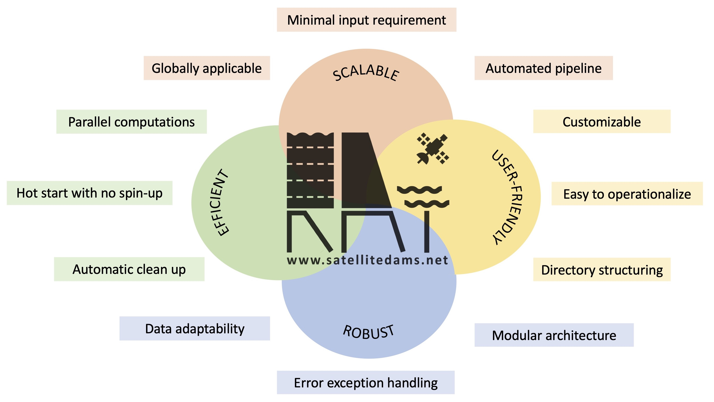

# Motivation

RAT was developed as a first-of-its-kind reservoir monitoring tool that could remotely monitor the changing dynamics of reservoirs, providing the global community with a comprehensive understanding of how they impact natural river flow. One of its original purposes was to serve as a decision-making tool for forming and evaluating water-sharing agreements between countries in a river basin. Despite the success of RAT 1.0, the monthly frequency of updating for reservoir state, limited its use. Monthly estimates of reservoir outflow and storage fail to capture the operating patterns of a reservoir at finer scales, such as hydropeaking, often required for many decision-making needs of the water manager. RAT 2.0 was therefore developed based on feedback from stakeholders, particularly from member countries of the Mekong River Commission (MRC), to improve the updating frequency (to weekly) and improve the accuracy of outflow data. This resulted in better decision-making for stakeholder agencies. As a result, RAT 2.0 was the first [major operational uptake by a large inter-governmental river agency such as the MRC](https://portal.mrcmekong.org/map-service/rsat).

Development of RAT {{rat_version.major}}.{{rat_version.minor}} is driven by the need to lower the barrier of entry for first-time users and to improve scalability, robustness and reproducibility. RAT {{rat_version.major}}.{{rat_version.minor}} is designed to be easy-to-install and easy-to-operate within an open-source software architecture. Software that is built on these design features can potentially mobilize the global water community to explore, use and improve RAT in the spirit of open-source development similar to Linux development. RAT {{rat_version.major}}.{{rat_version.minor}} can benefit not only governments, hydrologists, researchers, and stakeholders but also the individual user who rely on water resources for their livelihood, such as farmers, city residents, and fishermen. Access to near real-time information on the reservoir’s dynamic state can empower the individual user or a community by first quantifying any potential negative impact of floods and droughts, preparing for them, and optimally utilizing available water resources. The user-friendly installation and operation feature of RAT {{rat_version.major}}.{{rat_version.minor}} can help farmers make informed decisions on irrigation and crop planning, assist city residents in water conservation efforts and future usage planning, and aid fishermen in identifying the best fishing locations while avoiding areas with low water levels. Additionally, a scalable software like RAT {{rat_version.major}}.{{rat_version.minor}} can be used to plan and optimize hydroelectricity generation. These are just some of the many examples of what may be possible when a reservoir monitoring tool is made scalable and easy to install and operate. The below figure captures the major advancements in RAT {{rat_version.major}}.{{rat_version.minor}}. Our motivation for developing the RAT {{rat_version.major}}.{{rat_version.minor}} software is to accelerate breakthroughs in the broader field of managed water resources driven by the grassroots needs of global users.

