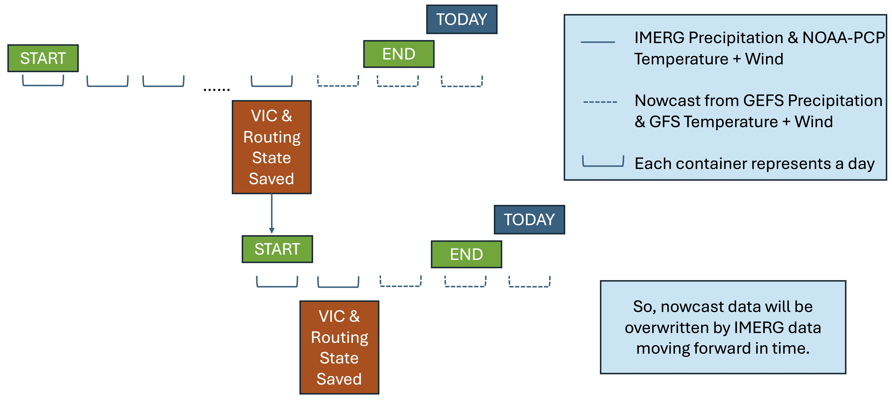

#Low Latency Mode

RAT {{rat_version.major}}.{{rat_version.minor}} can now run in operational mode with significantly reduced latency, ensuring near real-time execution. This is achieved by intelligently handling the transition between IMERG and GFS nowcast data. Low latency plugin is automatically enabled if the `end` date in [configuration file](../../Configuration/rat_config) is within the last three days from the current date. 

## How It Works



1. **Using IMERG Data Until the Latest Available Date:**  
    - RAT runs using IMERG data up to the last available day, which is **assumed** three days before today.
    - State files for VIC and Routing models are saved for this last IMERG-available day.

2. **Using GFS Nowcast for Recent Days (Last 3 Days from Today):**
    - For any days beyond the last IMERG-available day (up to the present), RAT uses GFS nowcast data.
    - This means that if today is Monday, then Saturday, Sunday and Monday will be run using GFS nowcast data.
    - The state files will be saved for Friday, which was the last day with IMERG data.

3. **Next Operational Run:**  
    - Rat run begins from the day when the state files were saved - which was the last IMERG-available day for previous run.
    - The state files are saved again for the last IMERG-available day for this run (three days before today).
    - GFS nowcast data is only used for the last three days from today, ensuring the best possible data replacement when IMERG becomes available.

<h5>Example Walkthrough</h5>

1. First Operational Run (Today = Monday)  
    - IMERG Data is Available Until Friday  
    - RAT runs using IMERG data up to Friday and saves state files for Friday.
    - GFS Nowcast Data is Used for the Last Three Days (Saturday to Monday)
    - Since IMERG is unavailable for these days, RAT switches to GFS nowcast data for Saturday, Sunday, and Monday.
2. Next Operational Run (Tuesday)  
    - IMERG Data for Saturday is Now Available
    - The new RAT execution starts from Friday (where state files were saved).
    - IMERG data is now used for Saturday, and state files are saved for Saturday.
    - GFS Data is Still Used for the Last Three Days (Sunday to Tuesday)
    - Since IMERG data is not yet available for Sunday to Tuesday, GFS nowcast data is used for these days.

<h5>Key Takeaways:</h5>

- GFS nowcast data is only used for the most recent three days from today.
- RAT, in operational mode, always starts from the last saved state file (latest day where IMERG was available).
- If the end date is beyond the last three days, RAT uses only IMERG data and saves the state files for the end date (no GFS needed).
- In each operational run, IMERG data replaces previously used GFS data when it becomes available.

## How to Use

The Low Latency Mode is activated automatically if the `end` date falls within the last three days from today, or if RAT is running in operational mode with a latency of less than three days. To execute RAT in operational Low Latency mode, use the following [`rat run` command](../../Commands/cli_commands/#executionoperationalization) in the terminal, where n_days can be set to 0, 1, or 2:
```
    rat run -p <PATH_OF_CONFIGURATION_FILE> -o n_days
```