# Getting Ready

To run RAT successfully, it requires three different sets of credentials mentioned [here](../UserGuide/#requirements). In this section, detailed and stepwise instructions are provided to get the credentials required for executing RAT {{rat_version.major}}.{{rat_version.minor}}.

### AVISO Credentials
Follow the steps to set up AVISO account and its credentials which will be used to access and download JASON-3 altimetry data. 

Step 1:  
Click [here](https://www.aviso.altimetry.fr/en/data/data-access/registration-form.html) to register for AVISO products.

Step 2:  
Fill out the registration form shown below.   
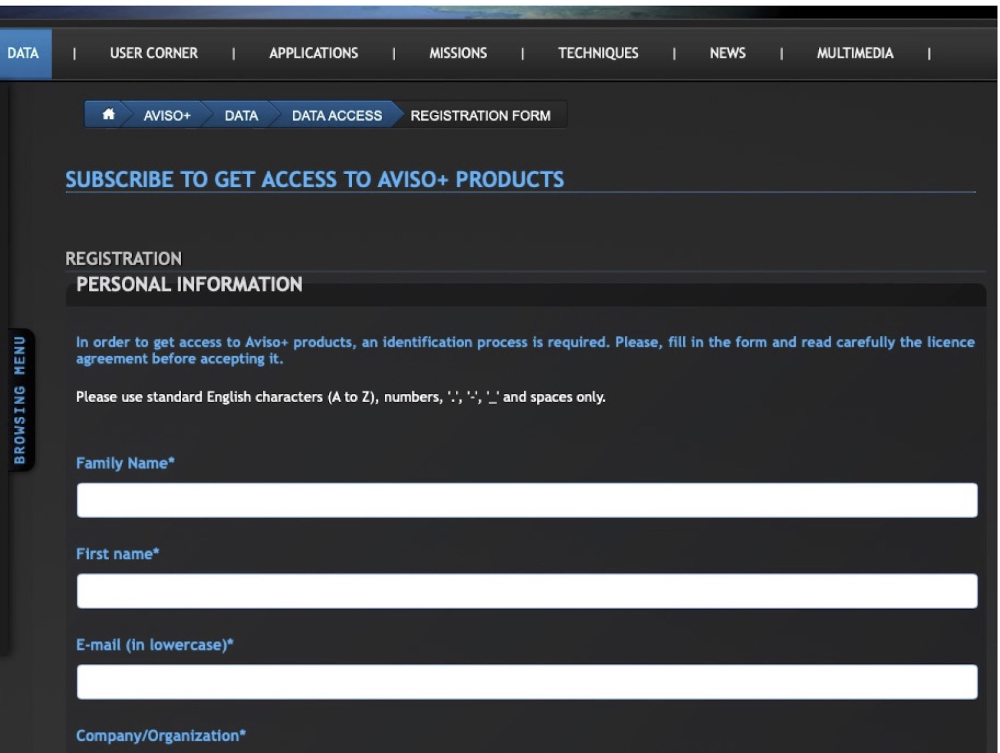

Step 3:  
Select ‘GDR/IGDR (Geophysical Data Records)’ in the Product Selection section as highlighted in the screenshot below.  
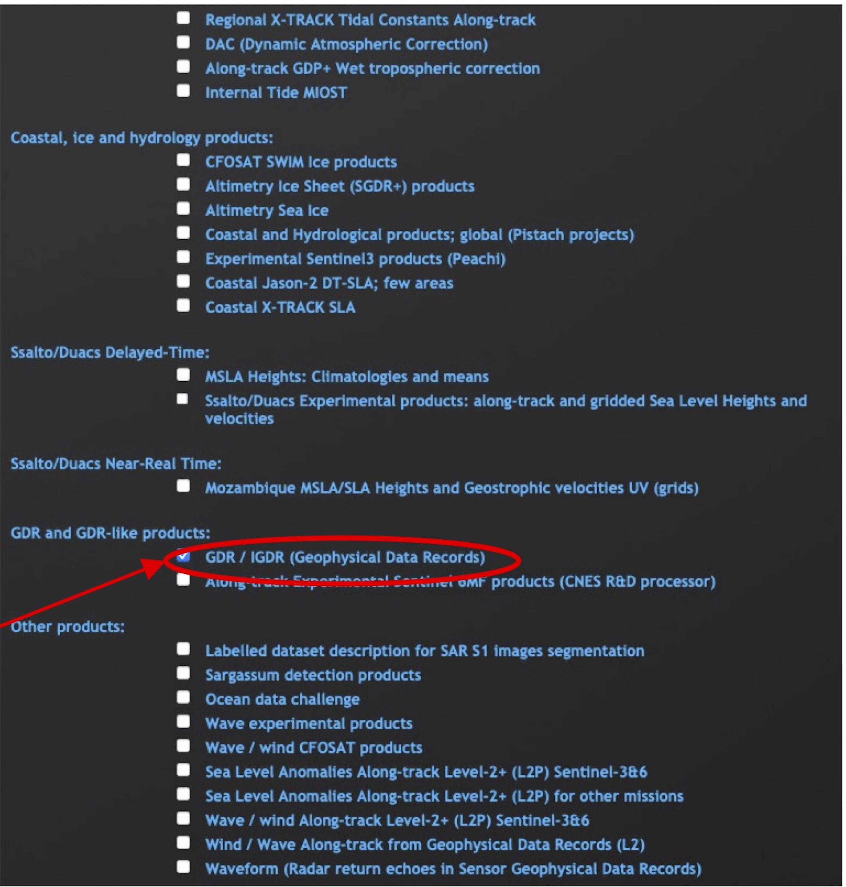

Step 4:  
Accept the terms and conditions.

Step 5:  
Submit the form.

### IMERG Credentials
Follow the steps to set up IMERG account and its credentials which will be used to access and download [IMERG Late Precipitation product](https://gpm.nasa.gov/taxonomy/term/1415).

Step 1:  
Click [here](https://registration.pps.eosdis.nasa.gov/registration/) to register for IMERG products.

Step 2:  
Click on **Register** (circled in the screenshot below) to open the registration form.  
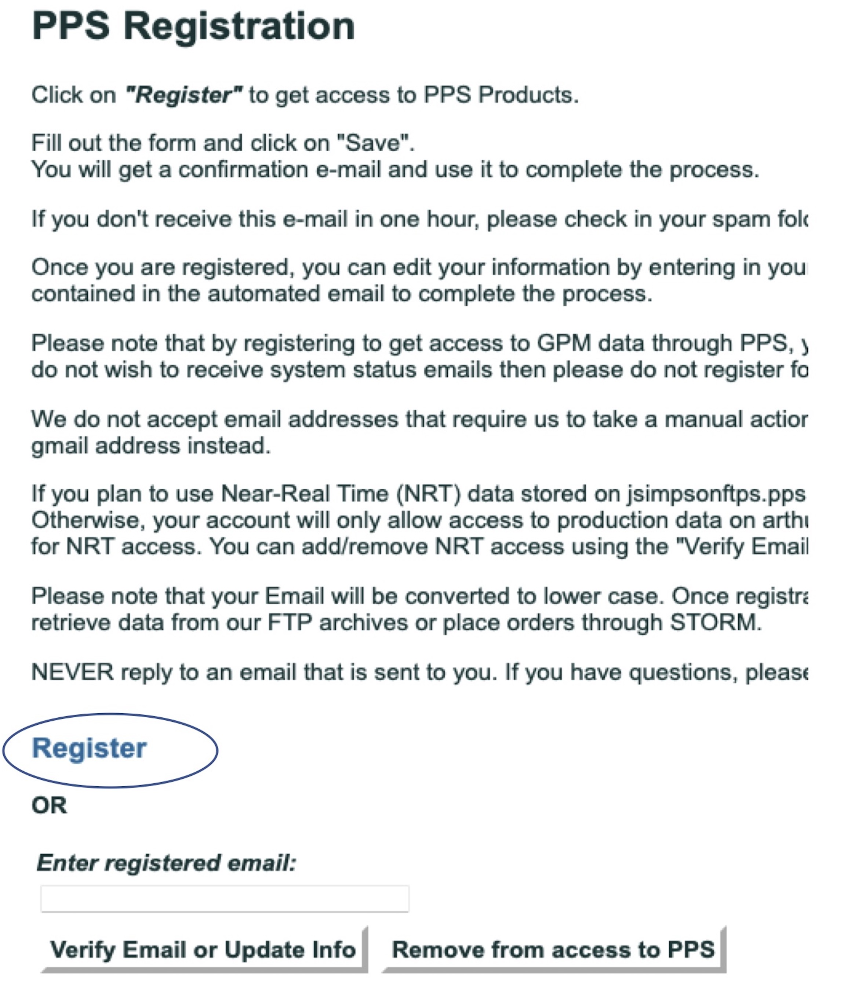

Step 3:  
Fill out the registration form shown below. Please make sure to check **'Near-Realtime Products'** (circled in the screenshot below).  
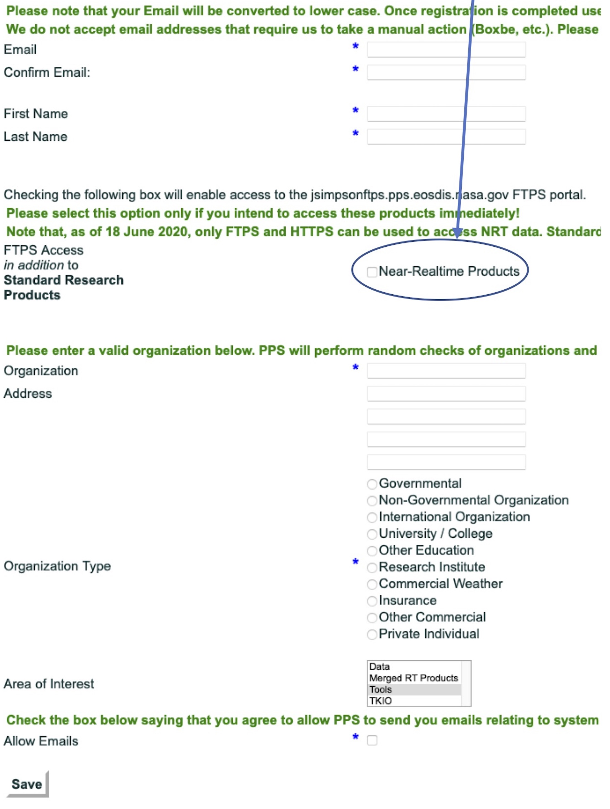

Step 4:  
Click on Save. You will get a confirmation email and use that to complete the process.

### GEE Credentials
RAT requires [google service account](https://cloud.google.com/iam/docs/service-account-overview), which is associated with a cloud project and both the project and service account should have access to earth engine api. It is free to create with a google user account (gmail account). Complete the listed tasks by following the instructions to set up a GEE service account. 

Task 1 : Create a google cloud project   
Step 1:  
Click [here](https://developers.google.com/earth-engine/cloud/earthengine_cloud_project_setup) to create a google cloud project. 
Step 2:  
Click on 'Create a Cloud project'. 
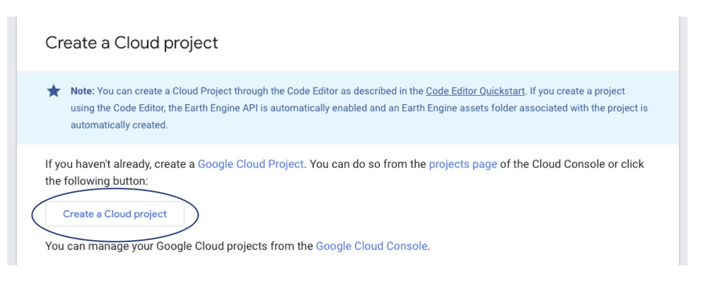
Step 3:  
Enter a Project name and Click on ’CREATE’. 
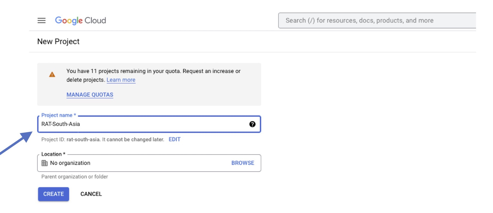

!!! tip_note "Tip"
    Project name can be something like ‘RAT-SE-Asia’ or ‘RAT Mekong’.

!!! note
    Please do not close the cloud project window which will open up as it will be used to continue Task-3. 

Task 2 : Enable Earth Engine API for the cloud project created.   
Step 1:  
Click [here](https://developers.google.com/earth-engine/cloud/earthengine_cloud_project_setup) to enable earth engine API. 
Step 2:  
Click on 'Enable the Earth Engine API’. 
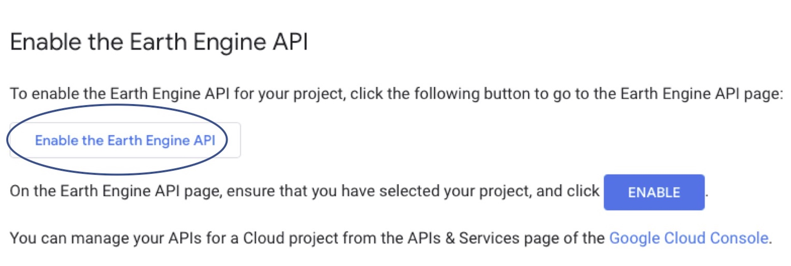
Step 3:  
Make sure the right project is selected and Click on ’ENABLE’.
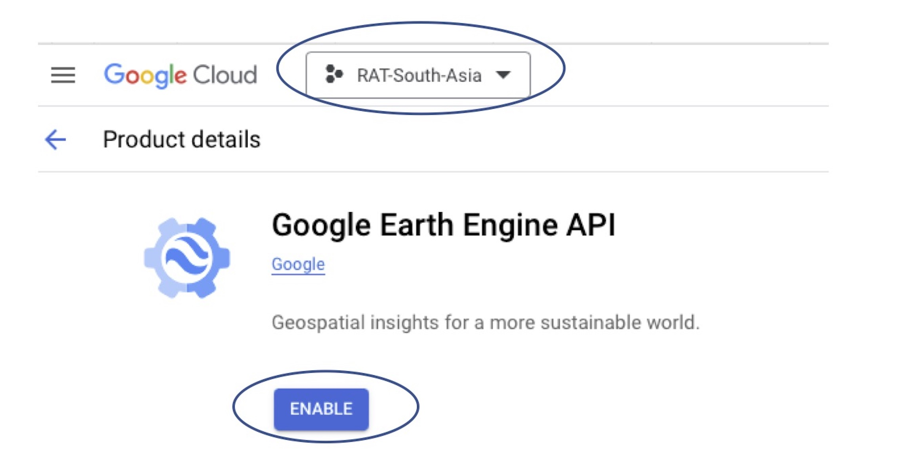

Task 3 : Create a service account.   
Step 1:  
In the cloud project window opened up after completing task 1, make sure the right project is selected and Click on ‘IAM & Admin’ > ‘Service Accounts’. 
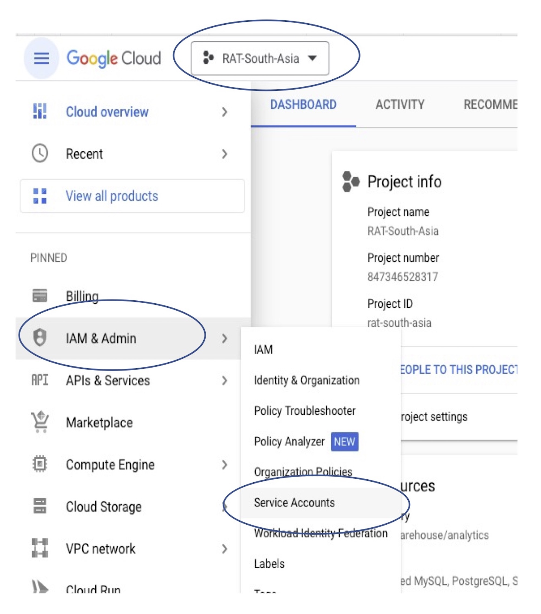
Step 2:  
Click on ‘CREATE SERVICE ACCOUNT’. 
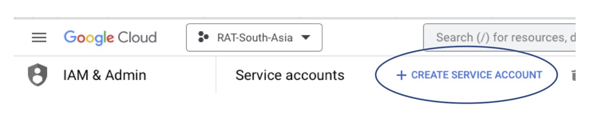
Step 3:  
Enter 'Service account name' and Click on ‘CREATE AND CONTINUE’.
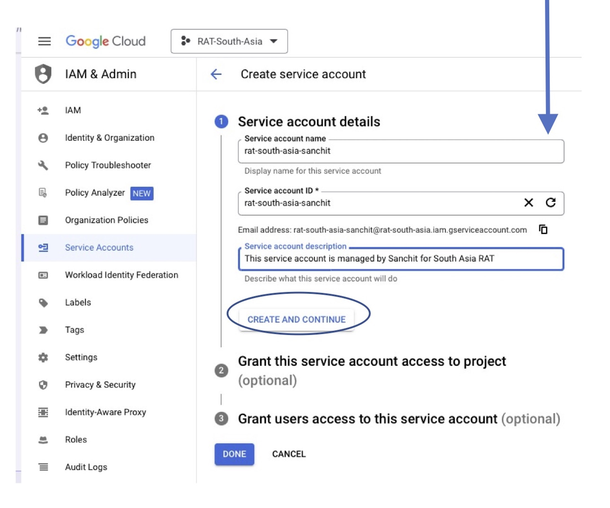

!!! tip_note "Tip"
    1. Service account name can be something like ‘rat-Mekong-YOUR_NAME’.
    2. Description can be about who will be using this service account and for what.

Step 4:  
Choose ‘Earth Engine’ > ‘Earth Engine Resource Admin’ for first role and choose ‘Service Usage’ > ‘Service Usage Consumer’ as another role.After selecting both roles, click on ‘CONTINUE’. And then click on ‘Done’. 
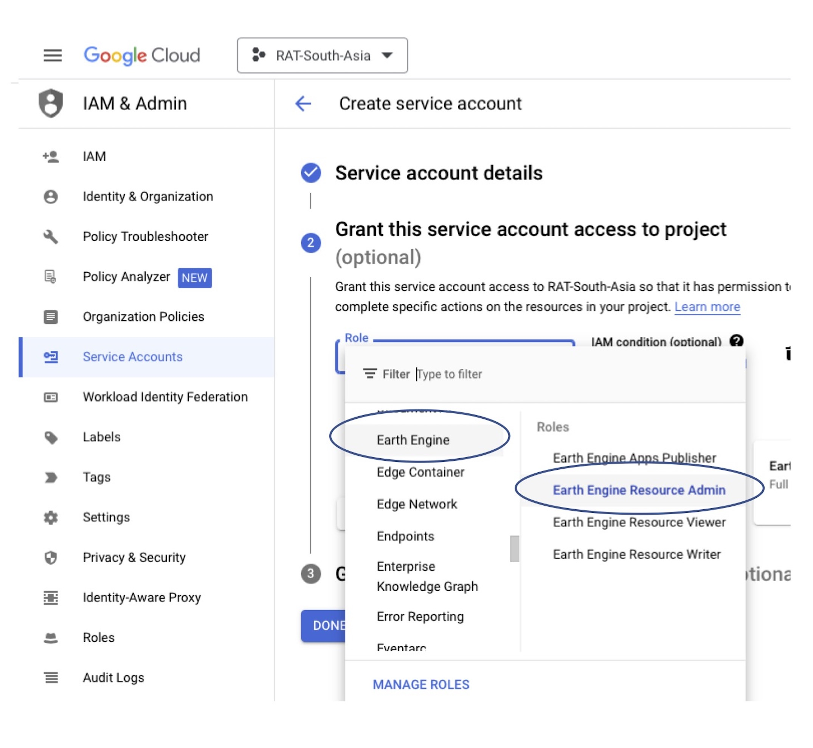

Step 5:  
Click on ‘Actions’ > ‘Manage Keys’ for the service account you created. 
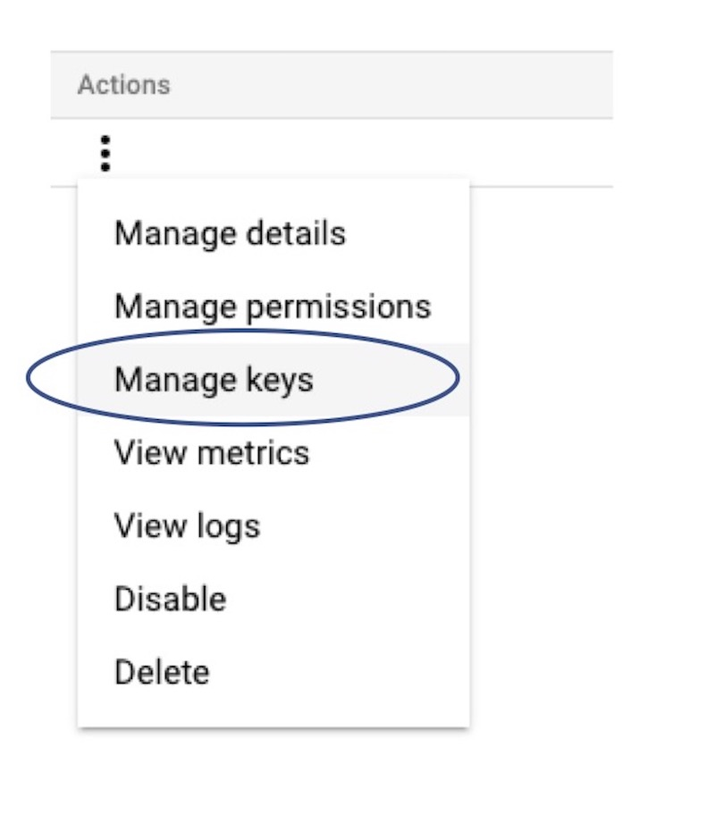
Step 6:  
Click on ‘Add KEY’ > ‘Create new key’ and select json. 
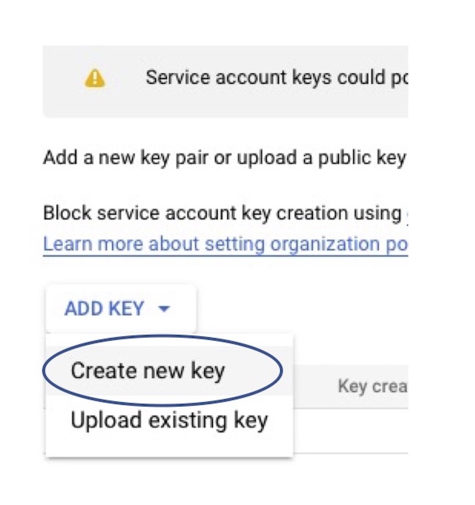

Task 4A (Recommended, in place of Task 4B) : Register the google cloud project to use Earth Engine.   
Step 1:  
Click [here](https://developers.google.com/earth-engine) to register the created google cloud project to use earth engine API and sign-in using the user ID used to create cloud project.  
Step 2:  
Click on ‘Register for Earth Engine’ (and select your email address if not signed in already). Then click on 'Register a Noncommercial or Commercial Cloud project'. 

Step 3:  
Select “Unpaid usage” if using for non-commercial activity. Select a suitable ‘Project type’ and click on ‘NEXT’. 

Step 4:  
Select “Choose an existing Google Cloud Project” and select the cloud project that you created in Task 1. Click on “Continue to Summary”. 

Step 5:  
Click on ‘Confirm’ and you can close the window.  

Task 4B (If Task 4A not done) : Register the service account to use Earth Engine.   
Step 1:  
Click [here](https://developers.google.com/earth-engine/guides/service_account#register-the-service-account-to-use-earth-engine) to register the service account created to use earth engine API.  
Step 2:  
Click on ‘this page’ and select your email address. 
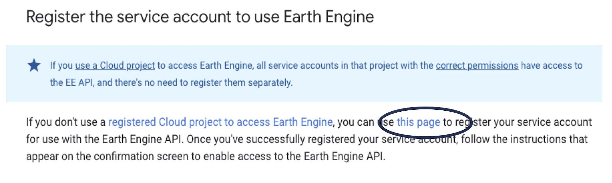
Step 3:  
Fill out the form and accept the terms. 
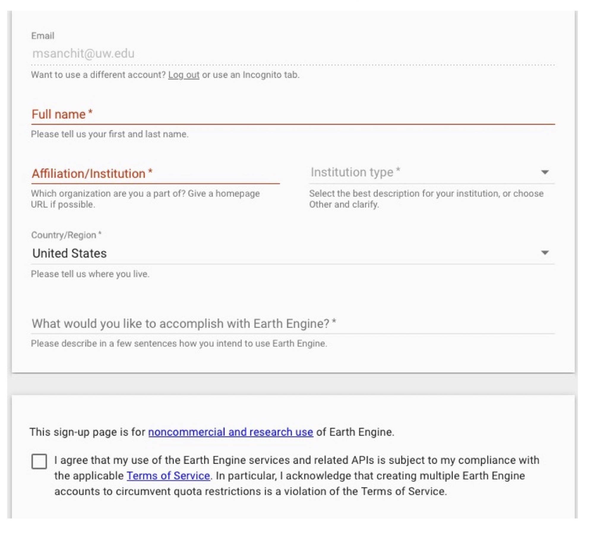
Step 4:  
Click on submit.  
Step 5:  
Again click [here](https://developers.google.com/earth-engine/guides/service_account#register-the-service-account-to-use-earth-engine) and repeat step 2 by clicking on ‘this page’. 

Step 6:  
Enter the created service account’s email address. 

!!! tip_note "Tip"
    Service account’s email address will look something like “foo-name@project-name.iam.gserviceaccount.com”

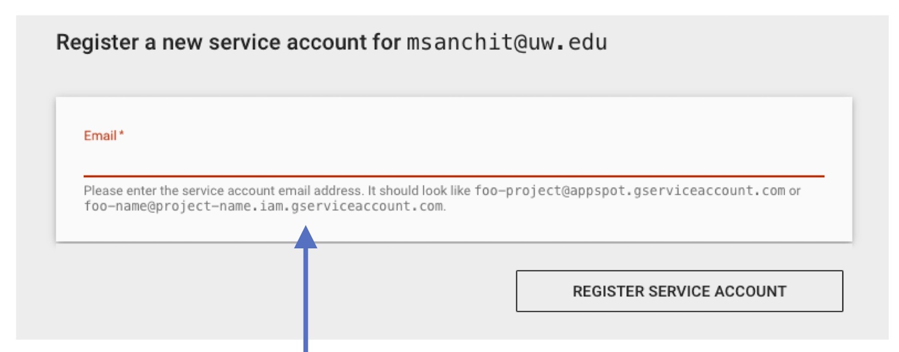
Step 7:  
Click on ‘REGISTER SERVICE ACCOUNT’.  

### RAT Credentials

RAT {{rat_version.major}}.{{rat_version.minor}} requires all the credentials created in the above sections in a single secret file. So, put all the credentials into a file named 'secrets.ini' by following the commands as mentioned [here in secrets file section](../Configuration/secrets.md).