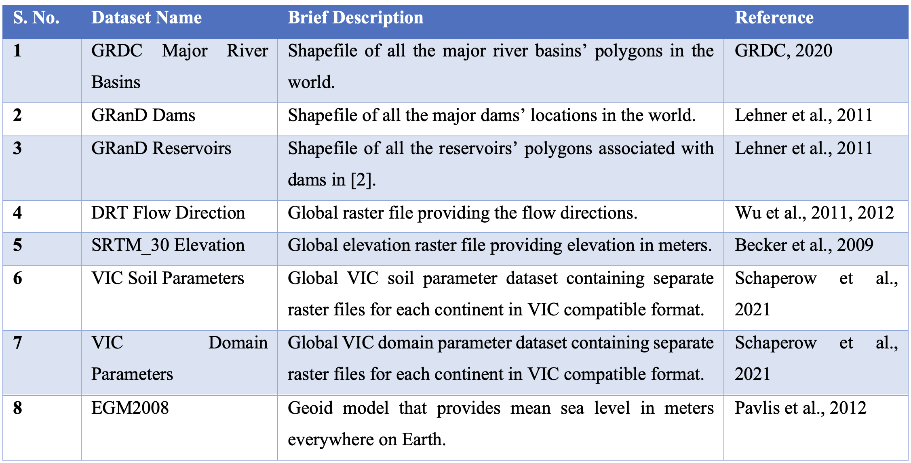

# Global Database

The inclusion and presence of the global database has brought about a transformative shift in the development of RAT {{rat_version.major}}.{{rat_version.minor}}. Without the global database, the significance of other enhancements in RAT {{rat_version.major}}.{{rat_version.minor}} would have been diminished. Leveraging various global datasets outlined in the below Table, RAT {{rat_version.major}}.{{rat_version.minor}} now possesses default inputs that enable the execution of RAT {{rat_version.major}}.{{rat_version.minor}} for any river basin worldwide for the first-time user. This approach allows the user to focus more on improving the skill of RAT iteratively once the initial version is quickly set up and made functional. 

The [GRDC river basin shapefile](https://www.bafg.de/GRDC/EN/02_srvcs/22_gslrs/221_MRB/riverbasins.html?nn=201274#doc2731742bodyText2) is utilized to generate a grid of the river basin for calculating inflow using VIC and routing models.  In addition, the boundary polygon from this shapefile is also employed to select only those reservoirs and dams from the [GRanD dam database (version 1.3)](https://www.globaldamwatch.org/grand) that lie within the river basin. RAT is then executed for only these dams and calculates inflow, surface area change, evaporation, and outflow. The routing model relies on the flow direction file provided by [NTSG Group at University of Montana](https://www.umt.edu/numerical-terradynamic-simulation-group/project/drt.php) to calculate inflow based on gridded runoff data obtained from VIC.

The DEM elevation raster from the Shuttle Radar Topography Mission (SRTM), provided by [University of California San Diego (UCSD)](https://eatlas.org.au/data/uuid/80301676-97fb-4bdf-b06c-e961e5c0cb0b), is used by RAT to create a domain parameter file required for the execution of MetSim. VIC soil and domain parameter raster files prepared by  [Jacob et al.(2021)](https://doi.org/10.1038/s41597-021-00999-4) offer global-scale and high-resolution information, respectively, enabling the creation of input parameter files required by VIC. 

Lastly, the Matlab version of [EGM2008 geoid model](https://doi.org/10.1029/2011JB008916) is used to extract reservoir levels from altimetry data. It is important to note that while these datasets are provided as default inputs for RAT execution, users have the flexibility to override these options according to their preferences and select dam locations that are not in the GranD database. Additionally, if no AEC (area elevation curve) file is provided for a reservoir, the [SRTM 30 m digital elevation model available in GEE](https://developers.google.com/earth-engine/datasets/catalog/CGIAR_SRTM90_V4) is used to automatically estimate the AEC for the reservoirs in question.
