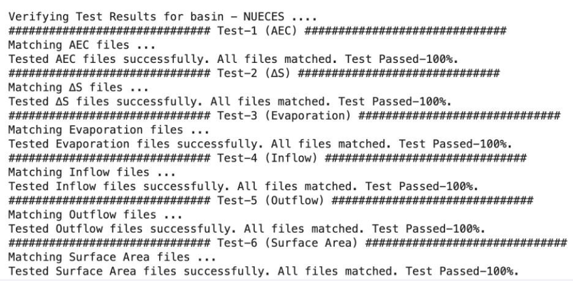
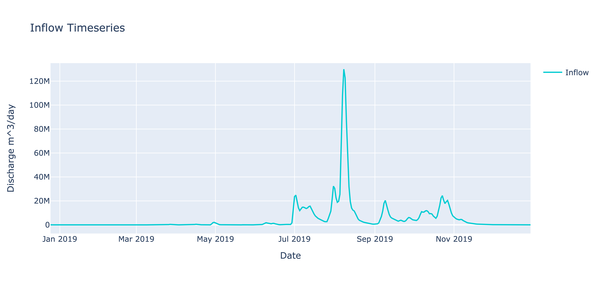
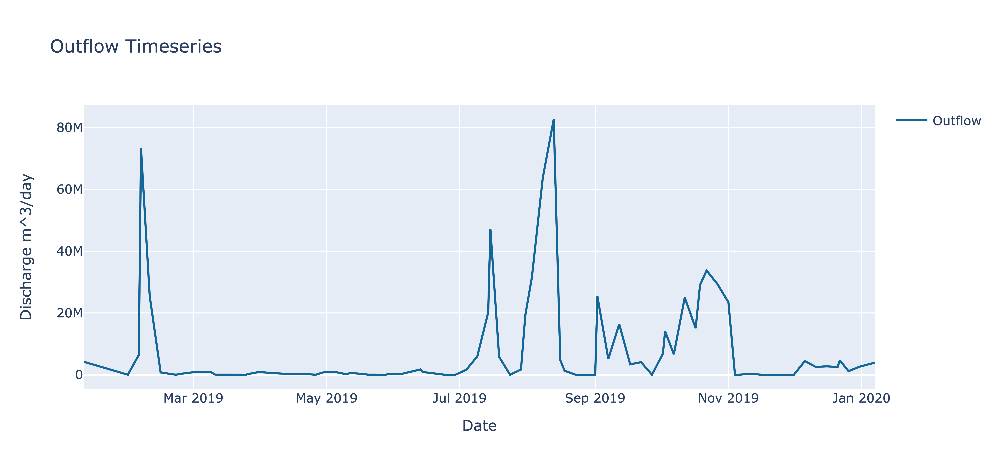
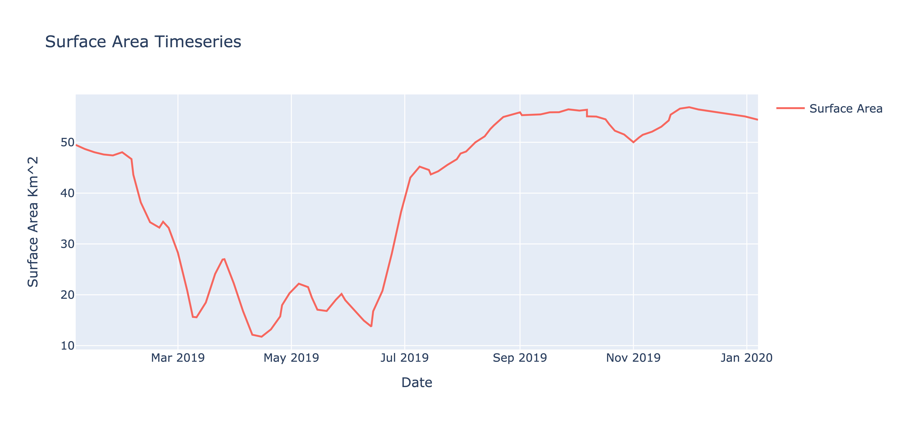
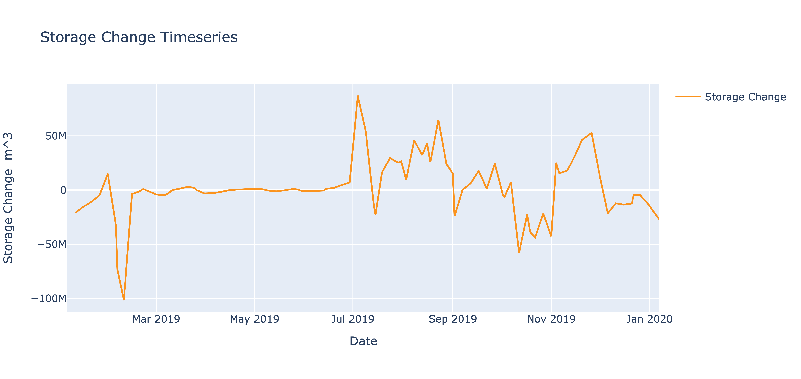
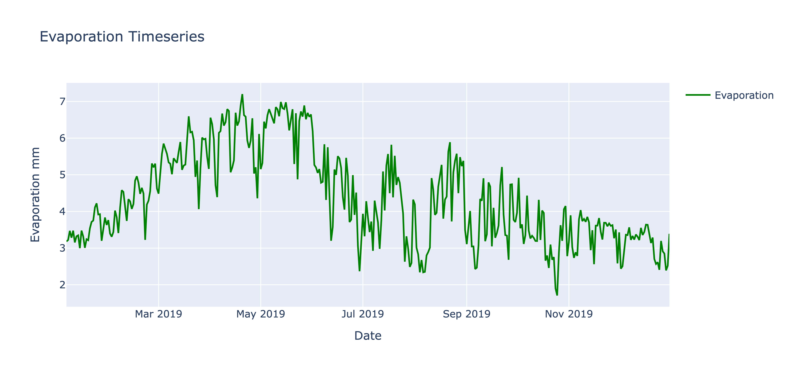
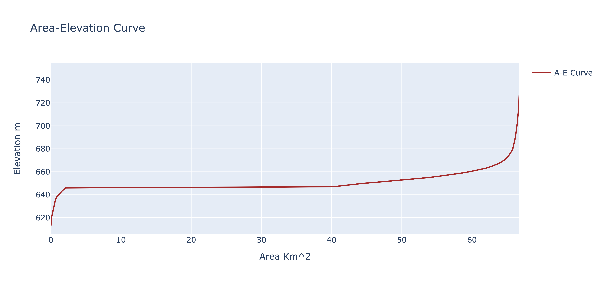

# 2019 Karnataka Floods

In this tutorial, we will examine the impact of reservoir operations in the context of extreme precipitation events. Specifically, we will investigate whether these operations serve to mitigate or exacerbate the damage resulting from floods using a real-world example described below.

In the initial week of August 2019, heavy monsoon rains led to severe flooding in the southern Indian state of Karnataka. Readers can search the internet to find more information on this devastating flood event. One of the news article is mentioned [here](https://floodlist.com/asia/india-karnataka-floods-october-2019). Here we provide a brief summary of the catastrophic flood.

!!! note "2019 Karnataka Floods"
    Thousands of individuals were evacuated to safer locations and relief camps. The catastrophic event resulted in approximately 70 casualties and displaced around 700,000 people. On August 8, 2019, Karnataka experienced nearly five times its usual rainfall. This exacerbated an already ongoing flood in the Belagavi district of Karnataka where there is a dam known as Hidkal (shown in below figure). To analyze the role of reservoir operations by Hidkal dam, we will focus on how it operated. 


We will use Reservoir Assessment Tool (RAT) to analyze the reservoir operations of Hidkal dam that makes use of satellite remote sensing. Here we provide step by step instructions on how to set up RAT for Hidkal dam in Karnataka (India) that should also be supplemented by the comprehensive documentation provided for RAT that the reader should also refer to as needed.

## Download

On [this](https://www.dropbox.com/scl/fo/fpl6as11pq87sfjzbue71/h?rlkey=fv88x7oqeu4xulqihlwopmkl7&dl=0) location in the cloud,  we have provided three important zipped files named ‘codes’, ‘custom_data’ and ‘final_outputs’. Readers should download these three files and unzip them first before going on to the next section. Later in the tutorial, we will refer to them as needed to help readers complete the tutorial.

## Requirements

1.	For this tutorial, please use a Linux OS based laptop or workstation which has RAM of 8GB or more and the minimum hard disk of 512 GB.
2.	Login credentials for [AVISO user-account](https://www.aviso.altimetry.fr/en/data/data-access/registration-form.html) (for reservoir height data)
3.	Login credentials for [IMERG user-account](https://registration.pps.eosdis.nasa.gov/registration/) (for accessing precipitation data for hydrologic model)
4.	Login credentials for [Earth Engine](https://developers.google.com/earth-engine/cloud/earthengine_cloud_project_setup) using service account (for reservoir storage change calculation)

!!! tip "Tip"
    To get the three set of credentials (requirement 2,3 and 4), follow the steps mentioned [here in Getting Ready section](../../QuickStart/GettingReady.md) and create a secrets file accordingly.

## Installation

Open a terminal and make sure your **current working directory path has no spaces**. Follow these steps in a terminal to get started:

***Step 1.*** Create a new directory with name 'rat_tutorial'. **We will refer to this directory as RAT project directory.**  
```
mkdir rat_tutorial
```

***Step 2.*** Change into the directory created. 
```  
cd rat_tutorial
```

***Step 3.*** Create a new conda environment with name '.rat_env'. Note that '.' in a path means current directory whereas '.' in front of a folder/file name means it should be hidden. Type ‘y’ and press enter when asked to proceed in the terminal.
``` 
conda create --prefix ./.rat_env
```

***Step 4.*** Activate the new environment.  
```
conda activate ./.rat_env
```

***Step 5.*** Install mamba using conda into the current environment from channel conda-forge. Type ‘y’ and press enter when asked to proceed in the terminal. 
```
conda install mamba -c conda-forge
```

***Step 6.*** Install rat library using mamba. mamba is also a package manager just like conda but it is more efficient in resolving dependencies version requirements. Type ‘y’ and press enter when asked to proceed in the terminal. 
```
mamba install rat -c conda-forge
```

## Activating Environment

To use RAT or its commands, you will always need to activate its python environment when you open a new terminal. Open a new terminal and make sure your current working directory is the project directory. Type the following command to activate RAT's python environment and press Enter.
```
conda activate ./.rat_env
```

## Initializing Environment

Initializing RAT takes care of setting up all the hydrological models and provides a set of default parameter files. Therefore, RAT requires only one-time initialization after installation. **You do not need to initialize RAT every time before using.**

In terminal, make sure your current working directory is the project directory and type the following command and press Enter. Again, please note that ‘.’ means the path of the current working directory which is the project directory’s path. You can use either of the two mentioned commands, where the first is using dropbox drive to download parameter files, the latter is using google drive.  
```
rat init -d . -dr dropbox
```
OR
```
rat init -d . -dr google
```

## Testing installation and initialization of RAT

Since RAT has now been installed and initialized, let us test if RAT is working properly and if your credentials are working fine. The default installation package of RAT comes with two test basins to test and verify if your RAT has been installed and initialized successfully. The two basins are 'NUECES' in Texas and 'GUNNISON' in Colorado (USA). **Open a new terminal and activate the environment as explained in ‘Activating Environment’ section.** Let us test it on NUECES for this exercise with the following command in the terminal:
```
rat test -d <PATH_OF_RAT_PROJECT_DIRECTORY> -b NUECES -s <PATH_TO_SECRETS_FILE> -dr dropbox
```

!!! note
    Replace <PATH_OF_RAT_PROJECT_DIRECTORY> with the path of the RAT project directory or with a '.' if your current working directory is the RAT's project directory and the <PATH_TO_SECRETS_FILE> with the path of the secrets file (created in Requirements section). Also, you can replace ‘dropbox’ with ‘google’ in the above command if ‘dropbox’ does not work. 

You can check RAT produced outputs inside RAT project directory at ***data/test_output/Texas/basins/Nueces/final_outputs/*** and compare them with the expected outputs provided in ***data/test_data/Nueces/expected_outputs/***. RAT by default provides the complete comparison and will tell you if the files were matched or not. A successful test completion should have the output as shown below in the terminal:



## Logging

Upon executing the test command provided above, two directories will be generated within the ***<PATH_OF_RAT_PROJECT_DIRECTORY>/data/***. 'test_data' will house the files utilized for running RAT on the test basin, predominantly comprising input files and their corresponding expected output files. Meanwhile, 'test_output' will store all data generated by RAT, including final outputs and logs. RAT produces two log files, detailed below, which can be utilized for monitoring RAT's progress and troubleshooting any encountered errors.

1.	Level-1 Log (Concise Log):
Access the file in project directory at ***data/test_output/runs/logs/RAT_run-YYYYMMDD-\*.log*** using a text editor that supports real-time updates. This enables us to observe the ongoing writing of the log file, providing insights into the step numbers executed by RAT and any encountered errors during the execution process.

2.	Level-2 Log (Detailed Log) : 
Open the file in project directory at ***data/test_output/Texas/logs/Nueces/RAT-NuecesYYYYMMDD-\*.log*** (once again using an editor that permits real-time updates). Here, you can scrutinize every process taking place within each step of RAT. This detailed log is primarily employed for debugging errors.

You can further read about the entire directory structure that usually exists inside the project directory in the [Directory Structure section](../../RAT_Data/DirectoryStructure.md).

## Configuration File

Navigate to ***params/rat_config.yml*** in project directory. This file is a partially complete configuration file where you can observe the paths for model (or Python environment) and parameter files in the Metsim, VIC, and Routing sections. These paths were configured during RAT initialization, with the initialization command populating these paths. It's important to note that global data hasn't been downloaded, which is why these paths remain unpopulated. It's worth mentioning that within the params directory, there are two additional configuration files: 'rat_config_template.yml' functions as a template, while 'test_config.yml' was employed by RAT for conducting RAT tests. 

!!! tip "Tip"
    If you are curious what these terms “Metsim, VIC” or ‘routing’ mean, you should refer to the [conceptual model of RAT](../../Model/ConceptualModel.md). However, here, we can safely treat these terms and components as ‘blackbox’ as the goal here is to set up RAT for Hidkal dam and focus on the reservoir operations.

!!! note
    Information regarding each parameter in the configuration file is provided in the [Configuration File section](../../Configuration/rat_config.md).

Now, you are ready to utilize RAT for Hidkal Dam. To begin with, download the ‘custom_data’ folder inside the project directory. Note that you should have already downloaded this ‘custom_data’ earlier before starting the tutorial from this [cloud location](https://www.dropbox.com/scl/fo/fpl6as11pq87sfjzbue71/h?rlkey=fv88x7oqeu4xulqihlwopmkl7&dl=0). Let us configure the file to analyze the reservoir operations of Hidkal Dam in the year 2019. In this instance, we are using a Python code to update the configuration file, although manual updates are also possible, albeit time-consuming.

``` python
from rat.toolbox import config #to update/create config
from rat.toolbox.MiscUtil import rel2abs #to convert relative paths to absolute
from datetime import date #to create datetime.date objects
```

The above section of the Python script involves importing modules, and comments have been included to delineate the specific purpose of each module.

```python
# Define the parameters to update in the configuration file of rat

##Dam                                                                                               
station_global = True #True if file is shapefile otherwise False for csv file.
station_file = "custom_data/Hidkal_Dam_RAT_Tutorial/Dam/Hidkal_Dam.json"
station_file_col_dict = {
                            'id_column'  : "GRAND_ID",
                            'name_column': "DAM_NAME",
                            'lon_column' : "LONG_DD",
                            'lat_column' : "LAT_DD"
                        }

## Reservoir  
reservoir_file = "custom_data/Hidkal_Dam_RAT_Tutorial/Dam/Hidkal_Reservoir.json"
reservoir_file_col_dict = {
                            'id_column'      : "GRAND_ID",
                            'dam_name_column': "DAM_NAME",
                            'area_column'    : "AREA_SKM"
                          }

## River Basin
basin_file = "custom_data/Hidkal_Dam_RAT_Tutorial/River_Basin/Krishna_River_Basin.json"
basin_file_col_dict = {
                        'id': "MRBID",
                      }
region_name = "India" # or Karnataka 
basin_name = "Krishna"
basin_id = 2312

## Grid Flow Direction
flow_direction_file = "custom_data/Hidkal_Dam_RAT_Tutorial/Flow_Direction_File/Krishna_Basin_Flow_Direction.asc"

## Metsim Parameter Files
metsim_domain_file = "custom_data/Hidkal_Dam_RAT_Tutorial/Metsim_Parameter_Files/Metsim_Domain.nc"

## VIC Parameter Files
vic_global = False #False if providing specific parameter files for the basin
vic_soil_param_file = "custom_data/Hidkal_Dam_RAT_Tutorial/VIC_Parameter_Files/Vic_Soil_Param_Krishna_Basin.nc"
vic_domain_file = "custom_data/Hidkal_Dam_RAT_Tutorial/VIC_Parameter_Files/Vic_Domain_Krishna_Basin.nc"

## Specifying Run Parameters
steps = [1, 2, 3, 4, 5, 6, 7, 8, 9, 10, 12, 13, 14] #Not running altimeter
start_date = date(2019,1,1)  
end_date = date(2019,12,31)    
spin_up = False #True if running without state files otherwise True
vic_init_state = "custom_data/Hidkal_Dam_RAT_Tutorial/Initial_State_Files/Vic_Init_State_Krishna_Basin_2019-01-01.nc"
rout_init_state = "custom_data/Hidkal_Dam_RAT_Tutorial/Initial_State_Files/Routing_Init_State_Krishna_Basin_2019-01-01.nc"

## Secrets & Configuration File
secrets_file = "params/secrets.ini"
config_file = "params/rat_config.yaml"
```

In the code snippet above, we have defined variables with pre-assigned values intended for inclusion in the configuration file. For this exercise, there is no need to modify the values of any variables as all the paths are relative to the RAT project directory and therefore the python script should be executed from the project directory itself. However, if you are using RAT for any other reservoir or for a different time-period and adjustments are required, you can modify the variable values accordingly. 

For example, if you want to run RAT for Hoover Dam, you need to change the station file, reservoir file, basin file, flow direction file, metsim domain file, VIC domain file and VIC parameter files for the hydrologic model. You will also have to ensure that the format of these files remain the same. You can also change ‘start_date’ and ‘end_date’ variables to alter the duration for which you want to execute RAT. You can exclude the vic_init_state and rout_state_files and instead change ‘spin_up’ variable’s value to `True`. With spin_up true the computational time will increase as RAT will be executed for an additional 800 days.  

It's important to note that the single-quote strings, representing dictionary keys, should remain unchanged. **Another important thing to ensure is that your secrets file is inside params directory, otherwise change the path accordingly.**

Now, we will construct a Python dictionary to update the configuration file using the previously declared variables. **It's essential to note that the following code can be used as it is, regardless of the scenario where you are using RAT.**
```python
params_to_update={
    
'GLOBAL': {
            'steps'                    : steps,
            'basin_shpfile'            : rel2abs(basin_file), 
            'basin_shpfile_column_dict': basin_file_col_dict
          },
    
'BASIN' :{
            'region_name'    : region_name,
            'basin_name'     : basin_name,
            'basin_id'       : basin_id,
            'spin_up'        : spin_up,
            'start'          : start_date,
            'end'            : end_date,
            'vic_init_state' : rel2abs(vic_init_state),
            'rout_init_state': rel2abs(rout_init_state)
         },
    
'METSIM':{
            'metsim_domain_file': rel2abs(metsim_domain_file)
         },
    
'VIC'   :{
            'vic_global_data'    : vic_global,
            'vic_soil_param_file': rel2abs(vic_soil_param_file),
            'vic_domain_file'    : rel2abs(vic_domain_file)
         },

'ROUTING':{
            'station_global_data'  : station_global,
            'stations_vector_file' : rel2abs(station_file),
            'stations_vector_file_columns_dict': station_file_col_dict
          },

'ROUTING PARAMETERS':{
            'flow_direction_file': rel2abs(flow_direction_file)
                     },

'GEE':  {
            'reservoir_vector_file':rel2abs(reservoir_file),
            'reservoir_vector_file_columns_dict': reservoir_file_col_dict
        },

'CONFIDENTIAL':{
            'secrets': rel2abs(secrets_file)
               }
}
```

The last step here before running RAT is to update the configuration file using the python dictionary created above.
```python
config.update_config(config_file,params_to_update)
```

The complete code is present in update_config.py in the codes folder. You should have already downloaded the codes folder from [this location on the cloud](https://www.dropbox.com/scl/fo/fpl6as11pq87sfjzbue71/h?rlkey=fv88x7oqeu4xulqihlwopmkl7&dl=0). Run the python script in the terminal after ensuring your RAT python environment is activated. After executing this python script, you will notice that the configuration file inside project directory at ***params/rat_config.yml*** will be populated with values defined by you.

## Execution

Use the below command in the terminal to execute RAT using the updated configuration file. It should take around 1-2 hours roughly depending on the computational power of the machine for complete RAT execution. Replace the <PATH_OF_RAT_CONFIGURATION_FILE> with the path of the configuration file (prepared above). For example: it should be like ‘rat_tutorial/params/rat_config.yml’. 
```
rat run -p <PATH_OF_RAT_CONFIGURATION_FILE>
```

## Analysis of RAT Outputs

Navigate to ***data/India/basins/Krishna/final_outputs***  inside the project directory to view the RAT generated inflow, outflow, surface area, evaporation, storage change and area elevation curve. ‘final_outputs’ folder has already been provided to you to match your outputs. You should have downloaded ‘final_outputs’ folder earlier from [this location on the cloud](https://www.dropbox.com/scl/fo/fpl6as11pq87sfjzbue71/h?rlkey=fv88x7oqeu4xulqihlwopmkl7&dl=0). You can visualize the data using Excel or can create interactive visualization plots using RAT module itself in python. Below is the code to create interactive plots and the snapshot of the figures created.

First, we will import RAT_RESERVOIR class from rat module that represents a reservoir object
in python.
```python
from rat.toolbox.visualize import RAT_RESERVOIR
```

Then we will create a reservoir instance and specify the path of the ‘final_outputs’ generated by RAT and the filename being used for the reservoir. 
```python
hidkal_reservoir = RAT_RESERVOIR(
final_outputs='data/India/basins/Krishna/final_outputs', file_name='4773_Hidkal.csv')
```

1. **Inflow:**
```python
inflow_figure = hidkal_reservoir.plot_var(
    var_to_observe = 'Inflow',
    title_for_plot = 'Inflow Timeseries',
    xlabel = 'Date',
    ylabel = 'Discharge',
    x_axis_units = '',
    y_axis_units = 'm^3/day'
)
inflow_figure.show()
```

Upon observing the Inflow timeseries interactive plot, zooming into the year 2019 reveals the graph below. Hovering over the peak inflow value indicates that it occurred on August 8, 2019. Consequently, RAT accurately identified the peak flood, aligning with our earlier mention in the introduction that Karnataka experienced rainfall five times higher than usual on this particular day.



2. **Outflow:**
```python
Outflow_figure = hidkal_reservoir.plot_var(
    var_to_observe = 'Outflow',
    title_for_plot = 'Outflow Timeseries',
    xlabel = 'Date',
    ylabel = 'Discharge',
    x_axis_units = '',
    y_axis_units = 'm^3/day'
)
Outflow_figure.show()
```

We can observe that during the flood period, the reservoir's outflow reached its peak. Zooming in on the below figure, we can see that the peak outflow occurred on the 13th of August, 2019. The prior observation was on the 8th of August. This is because RAT provides outflow estimations at a frequency of 2-5 days limited by the aggregate sampling frequency of satellites it uses to compute reservoir storage change. This can produce uncertainties about the occurrences in between satellite overpasses. Therefore, we can safely assume that the peak outflow was observed somewhere between the 8th and 13th of August. Despite this uncertainty, it is plausible to suggest that if the reservoir's outflow had been lowered beforehand, the damage caused by the incoming flood could have been mitigated by storing that excess flood water and releasing it more gradually over a longer time.



3. **Surface Area of Reservoir:**
```python
surface_area_figure = hidkal_reservoir.plot_var(
    var_to_observe = 'Surface Area',
    title_for_plot = 'Surface Area Timeseries',
    xlabel = 'Date',
    ylabel = 'Surface Area',
    x_axis_units = '',
    y_axis_units = 'Km^2'
)
surface_area_figure.show()
```

The surface area estimates were estimated using the Tiered Multi Sensor-Optical and SAR (TMS-OS; Das et al., 2022) algorithm at a frequency of 2-5 days (figure mentioned below). As satellite remote sensing data, despite its quantitative bias and uncertainty, are quite powerful for its qualitative trends, the trend of reservoir level is found to be accurately detected by RAT. The reservoir level was lowered from March to June 2019 which is the pre-monsoon period in South Asia. This standard practice is typically employed to accommodate the anticipated high inflows during the monsoon, allowing the reservoir to reach its full capacity by the end of the monsoon season. However, in this particular case, the reservoir was almost full at maximum capacity by early August, which is only half-way through the monsoon.



4. **Reservoir Storage Change:**
```python
storage_change_figure = hidkal_reservoir.plot_var(
    var_to_observe = 'Storage Change',
    title_for_plot = 'Storage Change Timeseries',
    xlabel = 'Date',
    ylabel = ' Storage Change ',
    x_axis_units = '',
    y_axis_units = 'm^3'
)
storage_change_figure.show()
```

The positive storage change observed during the months of July indicates that the reservoir commenced filling up in July and early August of 2019 (below figure). This is consistent with the surface area trends shown in the surface area time series plot above.



5. **Reservoir EvaporationL:**
```python
evaporation_figure = hidkal_reservoir.plot_var(
    var_to_observe = 'Evaporation',
    title_for_plot = 'Evaporation Timeseries',
    xlabel = 'Date',
    ylabel = 'Evaporation',
    x_axis_units = '',
    y_axis_units = 'mm'
)

evaporation_figure.show()
```

The amount of evaporation from the reservoir was estimated by RAT at a daily frequency as shown in below figure. At the time of flood peak, the evaporation is very low which is probably due to high humidity in the air in that region.



6. **Reservoir Area-Elevation Curve**
```python
aec_figure = hidkal_reservoir.plot_var(
    var_to_observe = 'A-E Curve',
    title_for_plot = 'Area-Elevation Curve',
    xlabel = 'Area',
    ylabel = 'Elevation',
    x_axis_units = 'Km^2',
    y_axis_units = 'm'
)

aec_figure.show()
```

RAT can construct the area elevation curve (AEC) for the Hidkal reservoir by leveraging the SRTM digital elevation model available in Google Earth Engine (GEE), as no survey-observed AEC was available here (shown in below figure). Since SRTM data was recorded in February 2000 whereas the reservoir already existed at that time, the elevation data above the reservoir level (that existed during February 2000) can be mapped of its bathymetry. Consequently, RAT extrapolates the AEC for lower reservoir levels. Where possible, users should apply their own judgement about the extrapolated region of the AEC due to potential uncertainty and use in-situ or higher quality reservoir topographic maps if available. 

